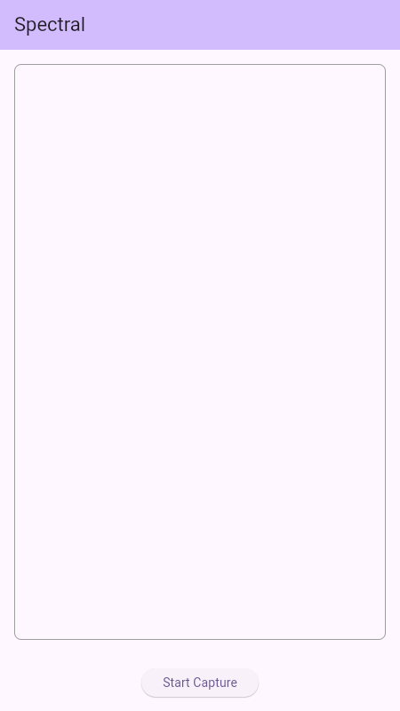

# Spectral

An Open Source Mobile App for the visualization of spectral data in multiple domains (Audio, RF, etc.) with a modern, elegant, and performant interface.

## 🚀 Overview

Spectral aims to provide users with a powerful yet user-friendly tool to observe wave and spectral data in real-time. Whether you are an audio engineer, an RF enthusiast, or just curious about the signals around you, Spectral offers highly configurable visualization modes to suit your needs.

## ✨ Features



- **Real-time Waveform Visualization:** Smooth and high-fidelity wave rendering with ghosting effects.
- **FFT Bar Chart:** High-performance frequency analysis with dynamic scaling.
- **Waterfall Display:** Time-frequency visualization for detecting patterns over time, integrated as a background layer.
- **Slick HUD Architecture:** Immersive "Waterfall Focus Mode" for a data-centric experience.
- **SDR (RF Support):** Initial integration for external RTL-SDR hardware via `rtl_tcp` (see [SDR Usage Guide](docs/sdr_usage_guide.md)).
- **Frequency Focus (Zoom):** Advanced Radio Dial Slider for panning and zooming into specific frequency bands.
- **Edge Dial Interaction:** Space-saving, tactile dials for Gain and Sensitivity adjustments.
- **Highly Configurable:** Customizable themes (Liquid Blue, Inferno, Monochrome, Emerald) and technical parameters (FFT Window Size/Type).
- **Modern UI:** Elegant, glassmorphic interface designed for mobile.
- **Localization:** Built with internationalization in mind from day one.

For a deep dive into these features, see [docs/features.md](docs/features.md).

## 🛠 Project Status

Spectral is currently in the **early development phase**. We have initialized the project with core audio visualization capabilities.

## 🛠 Getting Started

### Prerequisites
- [Flutter SDK](https://docs.flutter.dev/get-started/install) (latest stable version)
- Android Studio / VS Code with Flutter extensions
- Android/iOS emulator or a physical device for testing

### Setup
1. Clone the repository:
   ```bash
   git clone https://github.com/your-repo/spectral.git
   cd spectral
   ```
2. Install dependencies:
   ```bash
   flutter pub get
   ```

### Running the App
- **Run on a specific device:**
  ```bash
  flutter run
  ```
- **Run for Web:**
  ```bash
  flutter run -d chrome
  ```

### Building the App
- **Build Android APK:**
  ```bash
  flutter build apk --release
  ```
- **Build Web:**
  ```bash
  flutter build web --release
  ```

### Running Tests
- **Run all tests:**
  ```bash
  flutter test
  ```

## 🏷️ Versioning & Distribution

### Versioning
The app version is centrally managed in the `VERSION` file at the root of the project. To update the version:
1. Edit the `VERSION` file (e.g., `1.1.0+2`).
2. Run `./scripts/sync_version.sh` to synchronize it with `pubspec.yaml`.

### Distribution
To prepare a full distribution bundle (Android APKs, Web zip, and Screenshots):
```bash
./scripts/package_distribution.sh
```
The resulting bundle will be located in the `distribution/v<VERSION>/` directory.

For more details on publishing, see [docs/distribution_guide.md](docs/distribution_guide.md) and [docs/app_store_listing.md](docs/app_store_listing.md).

## 📂 Project Structure

- `lib/src/`: Core application source code.
- `docs/`: Detailed documentation and planning.
- `config/`: Configuration settings.
- `resources/`: Static assets and localization files.
- `tests/`: Unit and integration tests.

For more details, see [docs/project_structure.md](docs/project_structure.md).

## 🌍 Localization

We prioritize localization. Currently, we support:
- English (US) - `en`

Translations are managed via JSON files in `resources/locales/`.

## 🤝 Contributing

We welcome contributions! Please see [CONTRIBUTING.md](CONTRIBUTING.md) for guidelines.

## 📄 License

This project is licensed under the MIT License - see the [LICENSE](LICENSE) file for details.
