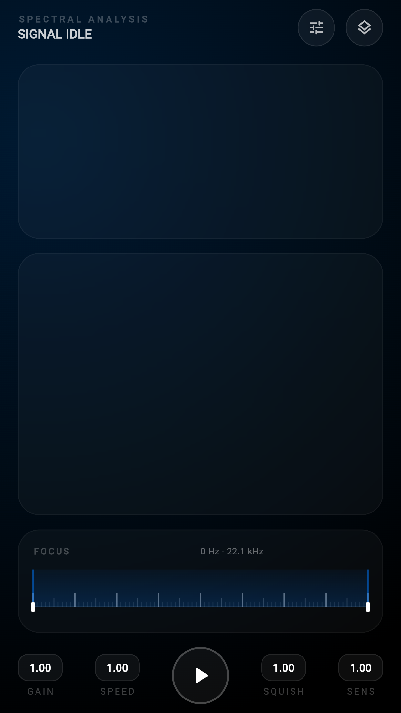

# Spectral

An Open Source Mobile App for the visualization of spectral data in multiple domains (Audio, RF, etc.) with a modern, elegant, and performant interface.

## 🚀 Overview

Spectral aims to provide users with a powerful yet user-friendly tool to observe wave and spectral data in real-time. Whether you are an audio engineer, an RF enthusiast, or just curious about the signals around you, Spectral offers highly configurable visualization modes to suit your needs.

## ✨ Features



- **Real-time Waveform Visualization:** Smooth and high-fidelity wave rendering with ghosting effects.
- **FFT Bar Chart:** High-performance frequency analysis with dynamic scaling.
- **Waterfall Display:** Time-frequency visualization for detecting patterns over time, integrated as a background layer.
- **Slick HUD Architecture:** Immersive "Waterfall Focus Mode" for a data-centric experience.
- **SDR (RF Support):** Real RTL-SDR hardware over USB OTG (native RTL2832U driver) or via an `rtl_tcp` bridge, with drag-to-tune digital down-conversion and AM/FM demodulation — see the [SDR Usage Guide](docs/sdr_usage_guide.md).
- **Frequency Focus (Zoom):** Advanced Radio Dial Slider for panning and zooming into specific frequency bands.
- **Edge Dial Interaction:** Space-saving, tactile dials for Gain and Sensitivity adjustments.
- **Highly Configurable:** Customizable themes (Frost, Magma, Gray, Emerald, Rainbow) and technical parameters (FFT Window Size/Type).
- **Modern UI:** Elegant, glassmorphic interface designed for mobile.
- **Localization:** 11 languages, managed as JSON files in `resources/locales/`.

For a deep dive into these features, see [docs/features.md](docs/features.md).

## 📈 Project Status

The core feature set — real-time visualization, SDR capture, demodulation, localization, and the distribution pipeline — is implemented. Current work focuses on validating the native USB driver against physical hardware; see [docs/roadmap.md](docs/roadmap.md).

## 🛠 Getting Started

### Prerequisites
- [Flutter SDK](https://docs.flutter.dev/get-started/install) (latest stable version)
- Android Studio / VS Code with Flutter extensions
- Android/iOS emulator or a physical device for testing

### Setup
1. Clone the repository and `cd` into it.
2. Install dependencies:
   ```bash
   flutter pub get
   ```

### Run, Test, Build
```bash
flutter run              # run on the connected device
flutter run -d chrome    # run for web
flutter test             # run all tests
bash scripts/build.sh <android|web|ios>   # optimized release builds
```

## 🏷️ Versioning & Distribution

The app version lives in the root `VERSION` file and is synced into `pubspec.yaml` with `./scripts/sync_version.sh`. A full distribution bundle (APKs, web zip, store screenshots) is produced by `./scripts/package_distribution.sh` into `distribution/v<VERSION>/`. Details: [docs/distribution_guide.md](docs/distribution_guide.md).

## 📂 Project Structure

See [docs/project_structure.md](docs/project_structure.md) for the directory layout and architecture overview.

## 🌍 Localization

The app ships in 11 languages (en, es, ca, gl, eu, fr, it, pt, de, ja, zh). Translations are managed via JSON files in `resources/locales/`, with full key parity enforced against `en.json`.

## 🤝 Contributing

We welcome contributions! Please see [CONTRIBUTING.md](CONTRIBUTING.md) for guidelines.

## 📄 License

This project is licensed under the MIT License - see the [LICENSE](LICENSE) file for details.
