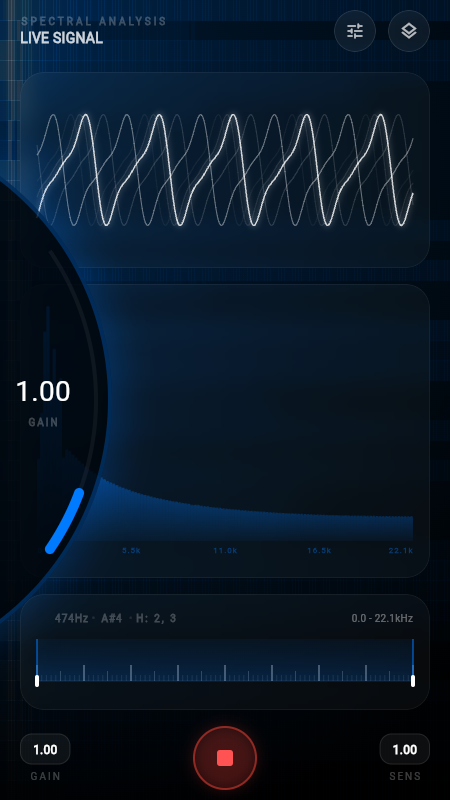
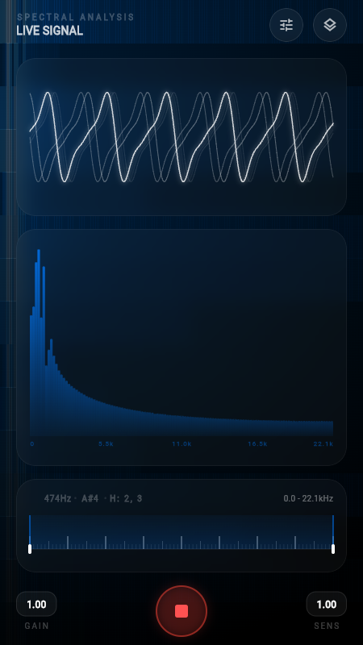
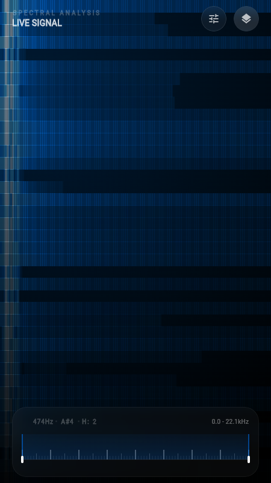
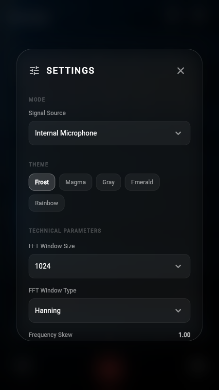

# Spectral Features

This document provides in-depth explanations of the key features and interactions available in Spectral.

## 🎛 Edge Dials (Gain & Sensitivity)

Spectral uses a unique, space-saving interaction model for signal adjustments.

- **Interaction:** Tap the **GAIN** or **SENS** triggers in the interaction bar to make the large edge dials persistent. Alternatively, **long-press and drag** the triggers vertically to adjust values on the fly.
- **Gain:** Adjusts the input signal amplification. Higher gain makes weak signals more visible in the waveform but may cause clipping.
- **Sensitivity:** Adjusts the scaling of the FFT (frequency) data. Higher sensitivity makes spectral peaks more prominent in the bar chart and waterfall.
- **Tactile Feedback:** The dials provide haptic ticks every 0.1 increment to ensure precise control without needing to look at the numbers.

## 🔍 Radio Dial Frequency Focus Slider

The Frequency Focus Slider is a powerful tool for zooming into specific spectral bands.

- **Panning:** Drag the center of the highlighted window to pan across the entire frequency range (0–22,050Hz).
- **Resizing:** Drag the handles on either side of the window to expand or contract the focus area.
- **Zooming:** The FFT bar chart and Waterfall visualization dynamically update to show only the selected frequency range, providing sub-pixel clarity for detailed analysis.
- **Tone Analysis:** When a clear tone is detected, the slider displays the fundamental frequency (e.g., `440Hz` or `12.4kHz`), the corresponding musical note (e.g., `A4`), and any detected harmonics.

## 🌊 Waterfall Focus Mode (Slick HUD)

Waterfall Focus Mode transforms the UI into an immersive, data-first dashboard.

- **Activation:** Tap the "Layers" icon in the header to toggle Focus Mode.
- **Layout:** All secondary UI elements (Waveform, FFT Chart, Interaction Bar) are hidden. The Waterfall visualization moves from the background to the foreground with 100% opacity.
- **HUD Elements:** Only the essential Frequency Focus Slider remains visible in its own independent glass card, allowing you to continue zooming and panning while immersed in the waterfall data.
- **Aesthetic:** The view includes a subtle scanline overlay and high-contrast gradients (depending on the selected theme) to evoke a professional "Heads-Up Display" feel.

## ⚙️ Technical Settings

Fine-tune the spectral engine to match your hardware and signal type.

- **FFT Window Size:** Choose between 512, 1024, 2048, or 4096 samples. Larger window sizes provide higher frequency resolution but increased latency and processing load.
- **FFT Window Type:**
  - **Hanning:** A good all-rounder with balanced frequency resolution and side-lobe suppression.
  - **Hamming:** Similar to Hanning but optimized for better side-lobe cancellation at the expense of slightly wider peaks.
  - **Blackman:** Provides the best side-lobe suppression, making it ideal for detecting weak signals near strong ones, though it results in the widest spectral peaks.
- **Themes:** Choose from multiple high-contrast palettes:
  - **Liquid Blue:** The signature minimalist aesthetic.
  - **Inferno:** High-energy heat map.
  - **Monochrome:** Classic high-contrast black and white.
  - **Emerald:** A clean, organic green look.

## 📡 SDR (RF Support)

Spectral now supports real-world RF spectral analysis using external SDR (Software Defined Radio) hardware.

- **External Hardware:** Connect standard RTL-SDR dongles via USB OTG.
- **rtl_tcp Protocol:** Streams raw I/Q data over local or network sockets.
- **Complex FFT Engine:** Specifically designed for RF I/Q signals with centered DC components.
- **Dynamic Configuration:** Adjust center frequency and bandwidth directly from Spectral's settings.

For setup and hardware requirements, see the [SDR Usage Guide](sdr_usage_guide.md).
