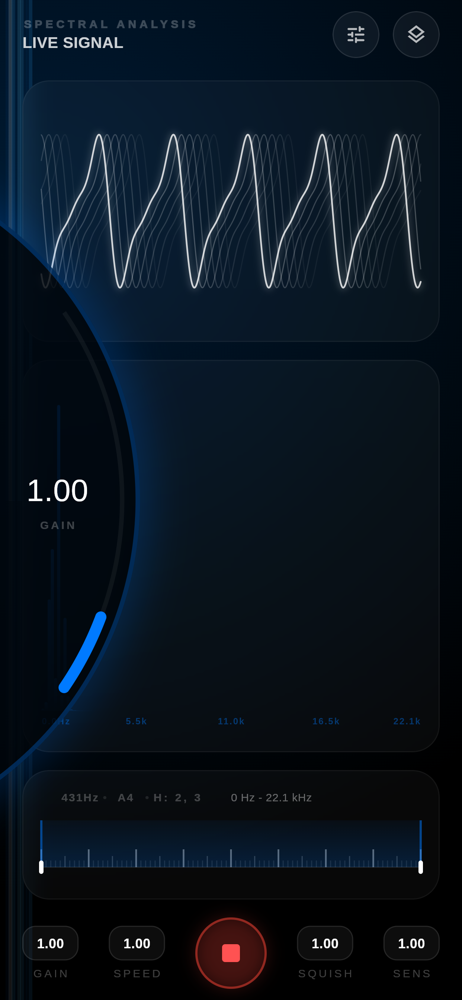
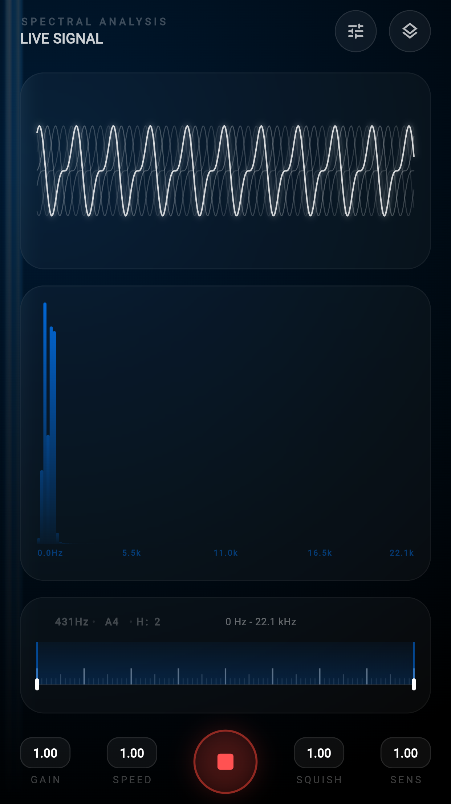
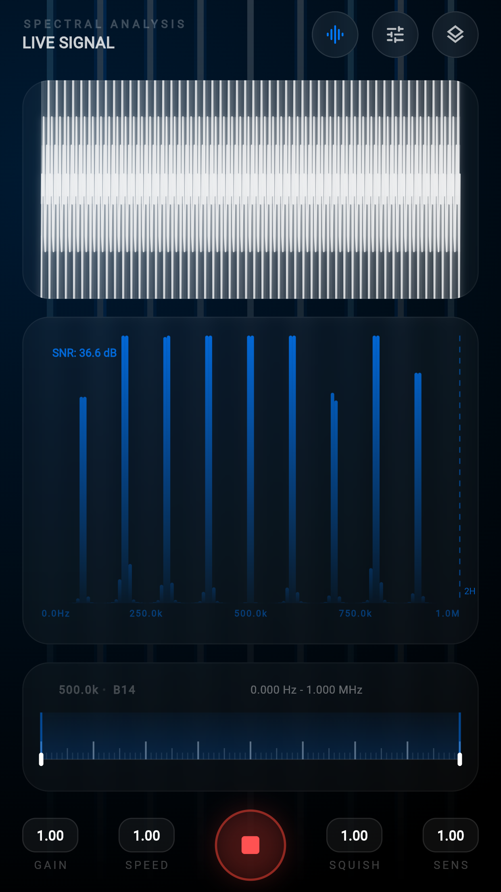
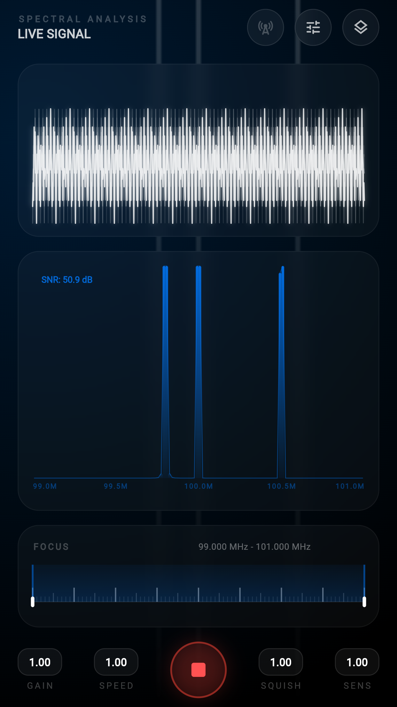
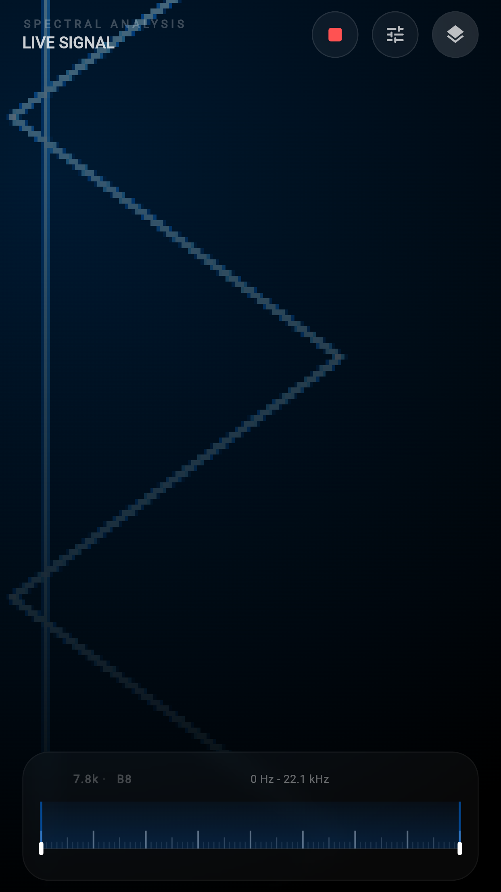
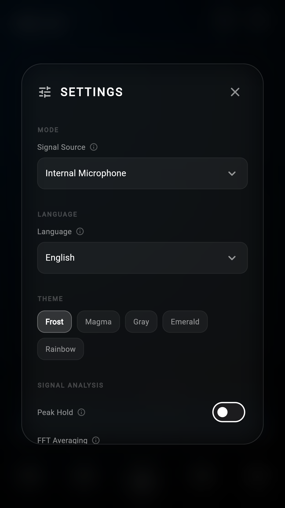
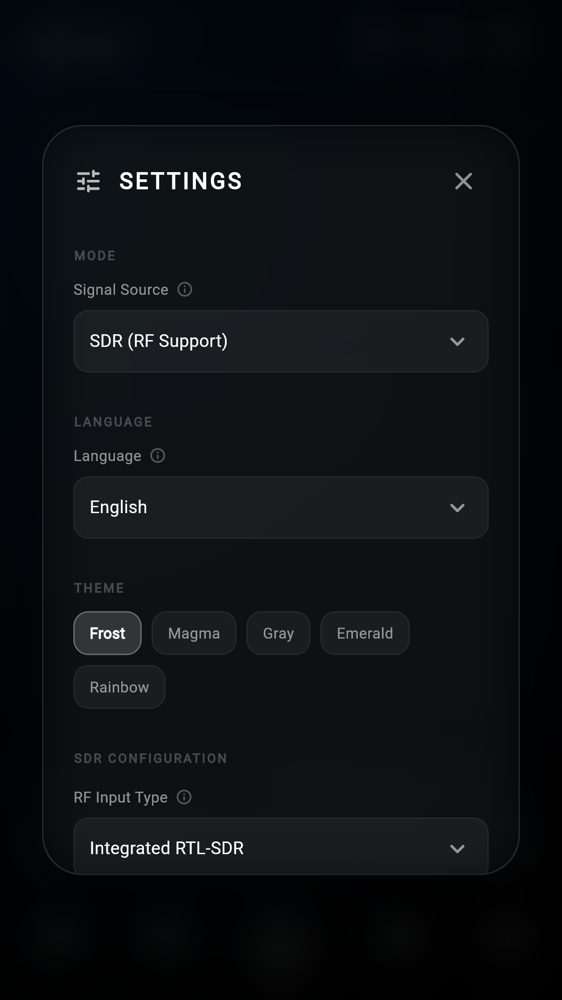

# Spectral Features

This document provides in-depth explanations of the key features and interactions available in Spectral.

## 🎛 Edge Dials (Gain & Sensitivity)

Spectral uses a unique, space-saving interaction model for signal adjustments.

- **Interaction:** Tap the **GAIN** or **SENS** triggers in the interaction bar to make the large edge dials persistent. Alternatively, **long-press and drag** the triggers vertically to adjust values on the fly.
- **Gain:** Adjusts the input signal amplification. Higher gain makes weak signals more visible in the waveform but may cause clipping.
- **Sensitivity:** Adjusts the scaling of the FFT (frequency) data. Higher sensitivity makes spectral peaks more prominent in the bar chart and waterfall.
- **Tactile Feedback:** The dials provide haptic ticks every 0.1 increment to ensure precise control without needing to look at the numbers.

## 🔍 Radio Dial Frequency Focus Slider

The Frequency Focus Slider is a powerful tool for zooming into specific spectral bands.

- **Panning:** Drag the center of the highlighted window to pan across the entire frequency range.
- **Resizing:** Drag the handles on either side of the window to expand or contract the focus area.
- **Zooming:** The FFT bar chart and Waterfall visualization dynamically update to show only the selected frequency range.
- **Tone Analysis:** When a clear tone is detected, the slider displays the fundamental frequency (e.g., `440Hz` or `12.4kHz`), the corresponding musical note (e.g., `A4`), and any detected harmonics.

## 🔀 RF or Audio: choosing what is analysed

On an SDR source there are two genuinely different signals to look at, and a
toggle in the header (next to the settings button) switches between them.

| View | Spectrum shows | Axis |
| --- | --- | --- |
| **Radio band** (default) | The whole captured RF band | Centre frequency ± half the capture rate |
| **Demodulated audio** | The audio recovered from the tuned channel | 0 Hz – channel Nyquist |

The choice drives the *entire* analysis chain, not just the picture: FFT input,
tone detection, harmonics, SNR, peak hold and the waterfall all follow it. Peak
hold and waterfall history are cleared on each switch, since they describe the
previous signal on a different axis.

Above, the same capture as below but with the toggle flipped: the axis has
become a 0 Hz-to-Nyquist audio spectrum, and SNR and harmonics now describe the
recovered programme.

The toggle only appears for an SDR source — an audio source has just the one
spectrum. It is shown but disabled when **Demodulation Mode** is `None`, since
there is then nothing to demodulate.

Switching views never costs you your station: the frequency slider is a display
zoom while the audio view is up, and the tuned channel is restored when you
return to the radio band.

## 📊 Advanced Spectral Analysis

Professional-grade tools for deep signal analysis. Peak hold, averaging, SNR,
and harmonics are toggled under **Settings → Signal Analysis**; markers are
placed directly on the chart.

### Peak Hold
- **Function:** Retains the maximum magnitude of every frequency bin over time.
- **Visual:** Displayed as a thin, persistent line above the real-time FFT bars.
- **Use Case:** Capturing transient signals or observing the peak envelope of a varying signal.

### FFT Averaging
- **Modes:**
  - **Linear:** A moving average of the last *N* frames. Great for steady-state noise reduction.
  - **Exponential:** Weighting recent frames more heavily than older ones. Provides smoother transitions than linear averaging.
- **Control:** The number of averaging frames can be adjusted from 2 to 50 in Settings.

### SNR Estimation
- **Metric:** Real-time Signal-to-Noise Ratio (dB) calculation for the primary peak.
- **Display:** Shown as a HUD overlay in the corner of the FFT chart.
- **Utility:** Helps assess the quality of the incoming signal relative to the background noise floor.

### Interactive Markers
- **Interaction:** Tap anywhere on the FFT bar chart to place up to 3 frequency markers. Tapping on (or near) an existing marker removes it; placing a fourth replaces the oldest.
- **Display:** Vertical lines with exact frequency labels.
- **Use Case:** Pinning the frequencies of spectral components so they can be compared as the signal changes.

### Harmonic Overlays
- **Function:** Automatically identifies and highlights integer multiples of a detected fundamental frequency.
- **Visual:** Dashed vertical lines labeled `2H`, `3H`, etc.
- **Use Case:** Identifying harmonic distortion or musical overtone structures.

## 💾 Recording, Playback & Export

The folder icon in the header opens the recordings library. It needs a
filesystem, so it is available in the native apps but not on web.

- **Recording:** While a live capture runs, **Start recording** writes the raw
  source stream (before gain, filtering, or demodulation) to the device. The
  header shows **RECORDING** until you stop. Stopping capture, switching
  source, or retuning ends the recording, since one file holds one sample
  rate and format. Recordings stop on their own at 1 GiB.
- **Formats:**
  - **Audio** is saved as 16-bit mono WAV at the capture rate, which any audio tool can open.
  - **I/Q** is saved as [SigMF](https://sigmf.org/): a `.sigmf-data` file of
    interleaved 16-bit samples (`ci16_le`) plus a `.sigmf-meta` JSON sidecar
    with the sample rate, centre frequency, and start time. Tools such as
    inspectrum and GNU Radio read it directly. At 2 MS/s this is about
    8 MB per second.
- **Playback:** **Play** replays a recording in real time through the full
  analysis chain, looping at the end, in place of the live source. The
  header shows **PLAYBACK**. An I/Q recording keeps its own centre
  frequency, so you can tune and demodulate stations inside it exactly as
  you would live. **Stop playback** returns to the live source.
- **Spectrum export (CSV):** Saves the spectrum currently on screen with one
  row per FFT bin: `frequency_hz`, `magnitude`, and `magnitude_db`, plus
  `peak_hold` and `peak_hold_db` when Peak Hold is on. Magnitudes are
  exported without the Sensitivity dial's display scale.
- **Sharing:** Every entry can be sent anywhere through the system share sheet.
  Sharing an I/Q recording sends the data file and its sidecar together.

## 🌊 Waterfall Focus Mode (Slick HUD)

Waterfall Focus Mode transforms the UI into an immersive, data-first dashboard.

- **Activation:** Tap the "Layers" icon in the header to toggle Focus Mode.
- **Layout:** All secondary UI elements (Waveform, FFT Chart, Interaction Bar) are hidden. The Waterfall visualization moves from the background to the foreground with 100% opacity.
- **HUD Elements:** Only the essential Frequency Focus Slider remains visible in its own independent glass card.
- **Aesthetic:** The view includes a subtle scanline overlay and high-contrast gradients to evoke a professional "Heads-Up Display" feel.

## ⚙️ Technical Settings

Fine-tune the spectral engine to match your hardware and signal type.

- **FFT Window Size:** Choose between 512, 1024, 2048, or 4096 samples.
- **FFT Window Type:** Hanning, Hamming, Blackman, or Bartlett.
- **Themes:** Frost, Magma, Gray, Emerald, or Rainbow.

## 📡 SDR (RF Support)

Spectral supports real-world RF spectral analysis using external SDR (Software Defined Radio) hardware.

- **Real Hardware via rtl_tcp:** Drive a standard RTL-SDR dongle through an `rtl_tcp` bridge (an Android driver app, or the desktop/Pi `rtl_tcp` binary), with frequency, sample-rate, PPM-correction, and automatic-gain control.
- **Integrated USB driver (Android):** Plug an RTL-SDR into the phone over USB OTG and Spectral offers to open it directly — no bridge app. The app claims the dongle, runs the RTL2832U + R820T/R828D bring-up in-process, and streams live I/Q. Hot-plug and unplug are handled while running. *Hardware validation is still in progress; rtl_tcp remains the proven path.*
- **PPM Correction:** Calibrate for hardware oscillator offsets to ensure frequency accuracy.
- **Tune by dragging:** The waterfall shows the whole captured band; drag the frequency slider onto a peak and the audio follows. The selection drives a digital down-converter (mix to baseband, filter, decimate), so you hear only the selected slice — no hardware retune, no stream restart.
- **Complex FFT Engine:** Specifically designed for RF I/Q signals with centered DC components.

For setup and hardware requirements, see the [SDR Usage Guide](sdr_usage_guide.md).
